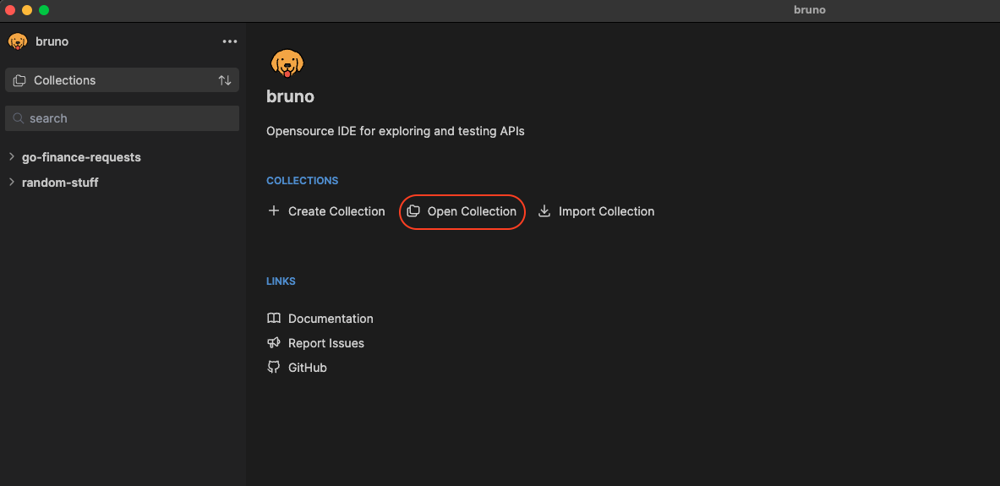
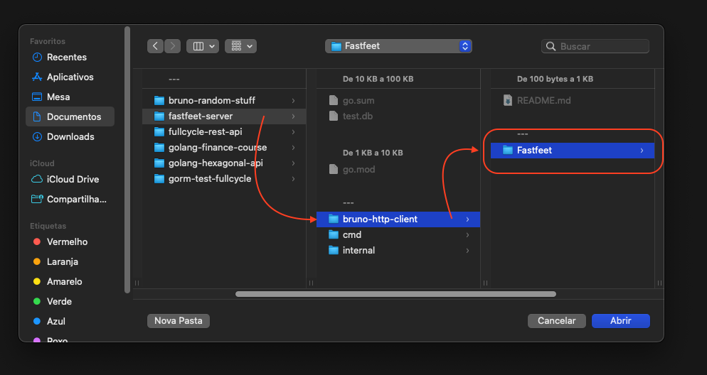
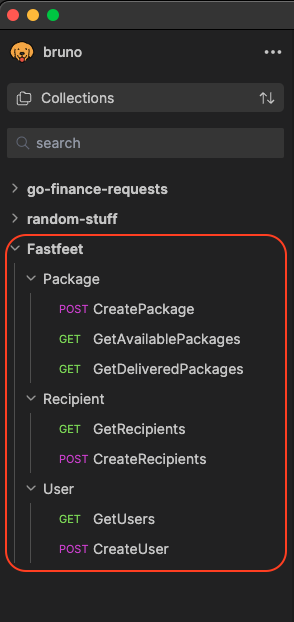

# Bruno Requests Files

Bruno is an HTTP client where you can easily create HTTP requests and use them to test an API.

The files in this folder are auto-generated, so it's advised not to modify them.

## How to use this Bruno collection on your machine

Bruno's official website can be find here: https://www.usebruno.com

To use the client on your computer, follow these steps:

1. Download it according to your operating system here: https://www.usebruno.com/downloads

2. Open the Bruno app

3. Click on "Open Collection"

4. On the Finder/Explorer app, locate the repo folder and select the **"Fastfeet"** folder, which is inside of the "bruno-http-client" folder

5. After that, your Bruno app will have the requests that are inside this folder. Use them to manually test the API in your computer.

